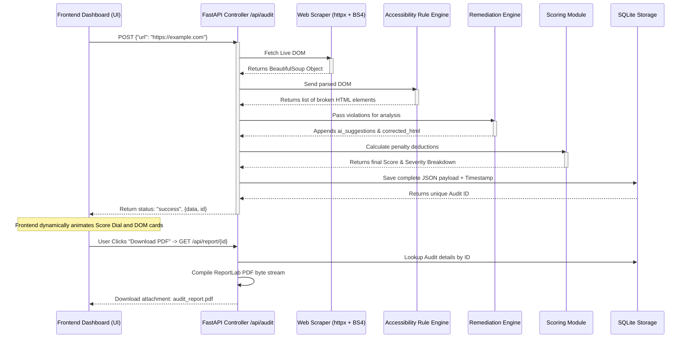

# AccessGuard: Real-Time Web Accessibility Audit Platform

AccessGuard is a production-grade, self-correcting web accessibility intelligence platform. It performs real-time, instantaneous accessibility audits on live websites, generates contextual AI-driven remediation suggestions without replying on external APIs, and compiles professional, branded PDF reports.

## 🚀 Key Features
- **Real-Time Web Scraper**: Bypasses basic bot protections to extract live DOM data instantly. No mock or static data is used.
- **Dynamic Rule Engine**: Directly evaluates raw DOM elements against strict accessibility standards (e.g., WCAG missing alt tags, disconnected form labels, skipping heading hierarchies).
- **Smart Hybrid Remediation**: A deterministic, offline "AI" engine that analyzes the context of broken HTML elements (like extracting filename contexts or input names) to automatically write the corrected HTML and suggest descriptive alternatives.
- **Persistent SQLite Storage**: Audits are saved instantaneously to a local SQLite database along with their unique timestamps and severity breakdown constraints.
- **Premium Glassmorphism Dashboard**: A modern, single-page application built with Vanilla HTML/JS/CSS that visualizes the JSON output with dynamic score dials, interactive violation expandable cards, and color-coded severity breakdowns.
- **Dynamic PDF Reporting**: Instantly compiles the entire audit, including the smart AI suggestions and correctly escaped HTML snippets, into a downloadable, professionally stylized PDF.

---

## 🏗️ System Architecture 

AccessGuard is built on a highly decoupled architecture separating the data extraction, rule logic, and visual representation layers. 

### **The Technology Stack**
*   **Backend Server**: FastAPI (Python)
*   **Web Scraper**: HTTPX (Async requests) & BeautifulSoup4 (DOM Parsing)
*   **Database**: SQLite3 
*   **PDF Compiler**: ReportLab (Python)
*   **Frontend**: Vanilla HTML5, CSS3, JavaScript (ES6)

### **Module Breakdown**
1.  **`main.py` (Controller Layer)**: Sets up the FastAPI application, manages CORS for the frontend, and orchestrates the synchronous chaining of all underlying modules.
2.  **`scraper.py` (Mining Module)**: Safely retrieves the target URL's HTML payload and initializes the `BeautifulSoup` object.
3.  **`engine.py` (Analysis Module)**: Evaluates the parsed DOM, executing algorithms to find elements violating accessibility invariants.
4.  **`remediation.py` (Smart Engine)**: Takes the broken elements and generates perfectly formatted `ai_suggestion` strings and the `corrected_html` snippets.
5.  **`scoring.py` (Scoring Module)**: Aggregates penalty weights based on severity (Critical, High, Medium, Low) to compute a 0-100 score.
6.  **`database.py` (Storage Layer)**: Houses the SQLite queries to save the JSON structures and query audit histories.
7.  **`pdf_report.py` (Reporting Layer)**: Transforms the database objects into PDF byte streams.

---

## 🔀 Real-Time Data Flow Diagram

